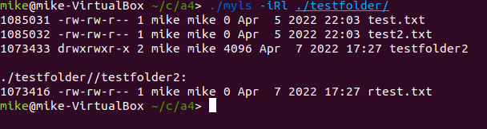

# myls

C project emulating the functionality of built in linux command ls  

# Usage 

make all to build  
make clean to clean  

run `ls <parameter list ...> <path list ...>`

parameters must come before paths  

accepted parameters:
- -i
    - show the inode of all files
- -l
    - long list mode, shows extended info about all files
- -R
    - recursive, print all child directories

